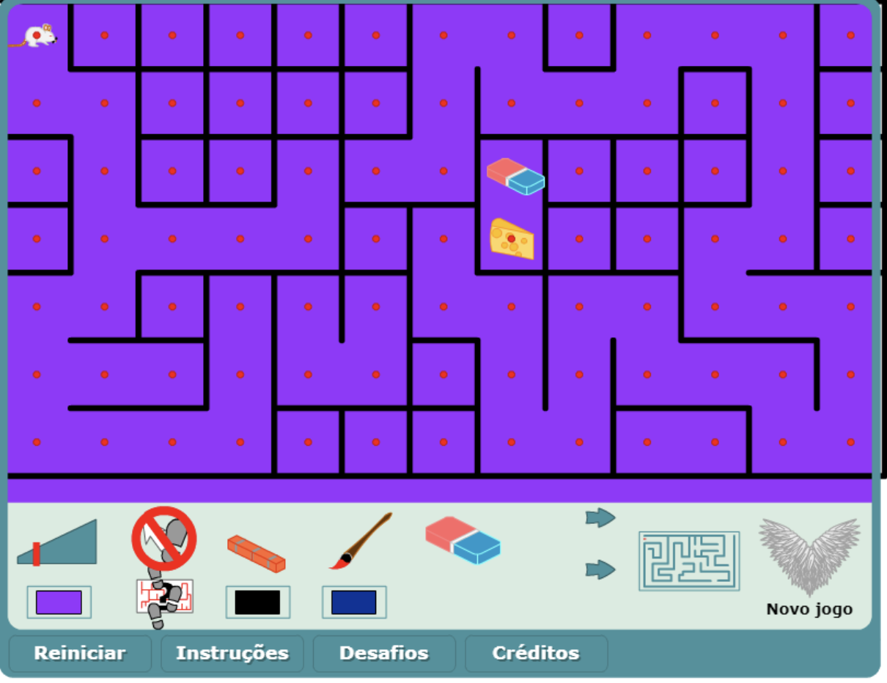

<!-- _class: title -->

# Resolução de Problemas por meio de Busca


<br><br><br><br><br>

## Prof. Sérgio Nery Simões
### IFES - Campus Serra

<br>

Boa noite!

Começaremos em alguns minutos...

---

# Algoritmos de Busca - Objetivo do Módulo
  <br>

  - Compreender os **fundamentos de busca** em Inteligência Artificial.
  - Explorar **algoritmos de busca não informada** (cega), como Busca em Largura (BFS) e Busca em Profundidade (DFS).
  - Estudar **algoritmos de busca informada** (heurística), como a Busca Gulosa e o Algoritmo A*.
  - **Aplicar** esses algoritmos em problemas práticos para melhor entendimento. 
  
---

# O que são Algoritmos de Busca?

<br>

- **Algoritmos de busca** são técnicas utilizadas em IA para encontrar soluções em um espaço de **estados**, que representa todos os possíveis estados de um problema. Por meio de **ações**, é possivel encontrar um estado que satisfaça uma condição de solução. 
<br>
- Existem dois tipos principais de busca: a **busca não-informada**, que não utiliza nenhuma informação adicional além da estrutura do problema (como BFS e DFS), e **busca informada**, que emprega heurísticas para guiar a busca de maneira mais eficiente, como nos algoritmos A* e Busca Gulosa. Esses algoritmos são fundamentais para resolver problemas como planejamento, jogos, e navegação.

---

**Espaço de Estados**:
<br>
  - Um **espaço de estados** é a representação de todos os estados possíveis de um problema e das transições que podem ocorrer entre esses estados.
  <br>
  - No problema do labirinto, cada posição no labirinto é um 
  **estado**, e cada movimento (para cima, para baixo, para a esquerda, para a direita) representa uma **transição entre estados**.

 

---

 **Problemas de Busca**:
 <br>
  - Em IA, **problemas de busca** envolvem a navegação por um espaço de estados para encontrar um caminho do estado inicial até o estado objetivo.
  <br>
  - **Elementos principais de um problema de busca**:
    - **Estado Inicial**: Ponto de partida da busca.
    - **Ações**: Movimentos ou decisões possíveis em cada estado.
    - **Estado Objetivo**: Estado que queremos alcançar.
    - **Custo do Caminho**: Soma dos custos das ações para chegar ao estado objetivo.
  ---
  
 

---

### **Busca Não Informada (Cega)**
 A **busca não informada** é uma técnica onde o algoritmo explora o espaço de estados sem informações adicionais sobre a proximidade do objetivo. Não utiliza nenhuma **heurística** para guiar a busca.

**Características**:
  - **Completude**: A busca é completa se for garantido que ela encontrará uma solução se existir uma.
  - **Complexidade de Tempo e Espaço**: Refere-se à quantidade de memória e tempo necessários.
  - **Otimalidade**: A busca é ótima se encontrar a solução com o menor custo.

**Aplicações**:
  - Usada quando não há informações sobre o espaço de estados ou heurísticas confiáveis.
--- 
- **Sugestão de Figura**: Diagrama mostrando um labirinto com estados sendo visitados de maneira aleatória, sem seguir uma direção específica em relação ao objetivo.

---

### **Algoritmo de Busca em Largura (BFS)**

 O Algoritmo de **Busca em Largura (BFS)** explora todos os nós em um nível antes de avançar para o próximo nível. Ele é usado para encontrar o caminho mais curto em termos de número de passos.

**Exemplo de pseudocódigo:**

- **Passos do Algoritmo**:
  1. Colocar o **estado inicial** na fila.
  2. Repetir até a fila estar vazia:
     - Remover o primeiro estado da fila e verificar se é o objetivo.
     - Se não for o objetivo, adicionar todos os estados filhos à fila.
---

  ### **Vantagens e Desvantagens BFS**:

  - **Vantagens**: Completo (se há solução, ele encontra) e ótimo (encontra a solução com menos passos).
  - **Desvantagens**: Requer muita memória e tempo para espaços de estados grandes.
     
- **Exemplo**:
  - Encontrar o caminho mais curto em um labirinto.
---
- **Sugestão de Figura**: Diagrama de uma árvore onde o BFS expande todos os nós de um nível antes de passar ao próximo.
---
**Exemplo de Pseudocódigo**:
  ```plaintext
  BFS(Estado_Inicial):
      Fila = [Estado_Inicial]
      Enquanto Fila não estiver vazia:
          Nó_Atual = Fila.desenfileirar()
          Se Nó_Atual for o Objetivo:
              Retornar Caminho
          Para cada Nó_Filho de Nó_Atual:
              Fila.enfileirar(Nó_Filho)
  ```

---

### **Algoritmo de Busca em Profundidade (DFS)**
  A **Busca em Profundidade (DFS)** explora o caminho completo em direção a um estado folha antes de retornar e explorar caminhos alternativos.Utiliza uma **pilha** para armazenar estados não explorados.

**Exemplo de pseudocódigo:**

- **Passos do Algoritmo**:
  1. Colocar o **estado inicial** na pilha.
  2. Repetir até a pilha estar vazia:
     - Remover o estado do topo da pilha e verificar se é o objetivo.
     - Se não for o objetivo, adicionar os estados filhos ao topo da pilha.
---
 ### **Vantagens e Desvantagens DFS** :

  - **Vantagens**: Menor uso de memória em comparação com BFS.
  - **Desvantagens**: Não é ótimo (não encontra o caminho mais curto) e pode entrar em ciclos infinitos. 
  
- **Exemplo**:
  - Exploração de uma rede de pastas e arquivos.
---
- **Sugestão de Figura**: Diagrama de uma árvore onde o DFS explora completamente um caminho antes de retroceder e explorar o próximo.
---
- **Pseudocódigo**:
  ```plaintext
  DFS(Estado_Inicial):
      Pilha = [Estado_Inicial]
      Enquanto Pilha não estiver vazia:
          Nó_Atual = Pilha.desempilhar()
          Se Nó_Atual for o Objetivo:
              Retornar Caminho
          Para cada Nó_Filho de Nó_Atual:
              Pilha.empilhar(Nó_Filho)
  ```

---

### **Comparação entre BFS e DFS**
- **Tabela Comparativa**:
  - **Completude**:
    - BFS: Completo (se uma solução existe, será encontrada).
    - DFS: Incompleto em grafos infinitos ou com ciclos.
  - **Otimalidade**:
    - BFS: Ótimo (encontra o menor caminho em termos de passos).
    - DFS: Não é ótimo.
---
  - **Complexidade de Tempo**:
    - BFS: \(O(b^d)\), onde \(b\) é o fator de ramificação e \(d\) a profundidade da solução.
    - DFS: \(O(b^m)\), onde \(m\) é a profundidade máxima do espaço de busca.
  - **Complexidade de Espaço**:
    - BFS: \(O(b^d)\), elevado para espaços grandes.
    - DFS: \(O(b \cdot m)\), menor consumo de memória.
  
- **Quando Utilizar**:
  - **BFS** é indicado para problemas onde o objetivo é encontrar o menor número de passos.
  - **DFS** é mais apropriado para problemas onde o espaço de memória é limitado ou a profundidade máxima é conhecida.
---
  - **Sugestão de Figura**: Tabela comparativa e um gráfico que ilustra a expansão da busca BFS em comparação com a DFS.


---
# Lista de Exercicios Módulo 2 - Algoritmos de Busca


## Exercício 1: Definição de Espaço de Estados
**Pergunta**: Defina o que é um **espaço de estados** e forneça um exemplo prático de como ele pode ser representado para um problema de navegação em um labirinto.

**Objetivo**: Verificar se os alunos compreendem o conceito de espaço de estados e como ele pode ser aplicado a problemas práticos.

---

## Exercício 2: Busca em Largura (BFS)
**Pergunta**: Dado o grafo abaixo, simule passo a passo a execução do algoritmo **BFS** começando do nó A e indique a ordem em que os nós serão visitados.

  A
 / \
B   C
/\   \
D E   F


**Objetivo**: Testar a compreensão da lógica de busca em largura e a sua aplicação em grafos.

---

## Exercício 3: Busca em Profundidade (DFS)
**Pergunta**: Usando o mesmo grafo do exercício anterior, aplique o algoritmo **DFS** a partir do nó A. Indique a ordem em que os nós são visitados.

**Objetivo**: Avaliar a habilidade de aplicar busca em profundidade e entender como o algoritmo explora os nós.

---

## Exercício 4: Busca A*
**Pergunta**: Considere o problema de navegação em um mapa, onde cada nó representa uma cidade e as arestas representam a distância entre elas. A seguir estão as distâncias reais e heurísticas estimadas (distância em linha reta até o destino).

| Cidade  | Distância Real (km) | Heurística (km até o objetivo) |
|---------|---------------------|-------------------------------|
| A -> B  | 2                   | 6                             |
| B -> C  | 2                   | 4                             |
| C -> D  | 3                   | 0 (Objetivo)                   |
| A -> E  | 5                   | 7                             |
| E -> D  | 4                   | 0 (Objetivo)                   |

Aplique o algoritmo **A*** para encontrar o caminho mais curto de A até D e mostre passo a passo a ordem de expansão dos nós.

**Objetivo**: Verificar o entendimento sobre busca informada e o uso de heurísticas no A*.

---

## Exercício 5: Heurísticas
**Pergunta**: Para o problema do 8-puzzle (quebra-cabeça deslizante), descreva duas funções heurísticas possíveis para ajudar a resolver o problema. Qual delas você acha que levaria a uma solução mais eficiente?

**Objetivo**: Avaliar a compreensão sobre o conceito de heurística e a capacidade de pensar em funções heurísticas úteis.
