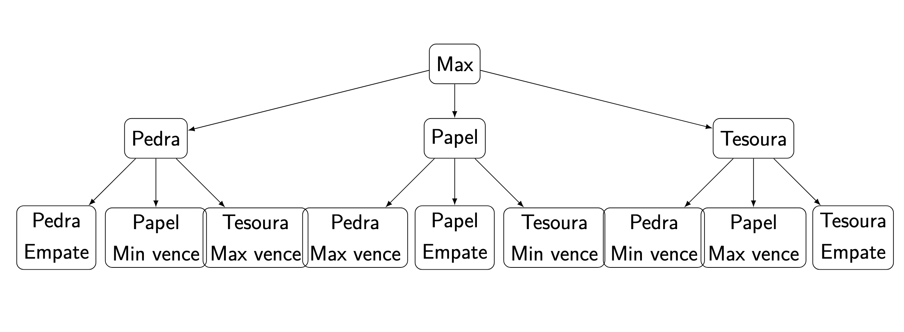

<!-- _class: title -->

# **Algoritmos de Otimização**

<br><br><br><br><br>

## Prof. Sérgio Nery Simões
### IFES - Campus Serra

<br>

Boa noite!

Começaremos em alguns minutos...

---

# **Busca Adversarial - Objetivo do Módulo**

  - Introduzir o conceito de **busca em cenários competitivos**.
  - Explorar o **algoritmo Minimax** (cega), como Busca em Largura (BFS) e Busca em Profundidade (DFS).
  - Estudar **Heurísticas e Profundidade Limitada**.
  - Entender o que é a **Poda Alfa-Beta**, 
  - **Aplicar** esses algoritmos em problemas contexto de jogos. 
  
---

# **O que é busca adversarial?**

Busca adversarial é uma técnica usada em inteligência artificial para resolver problemas onde há competição entre dois ou mais agentes, com objetivos que confiltam entre si. Exemplos clássicos incluem jogos como xadrez, damas e Jogo da Velha.
<br>
Diferente de uma busca tradicional (como encontrar o menor caminho em um grafo), aqui os agentes têm interesses opostos.
Um agente busca maximizar sua pontuação, enquanto o outro busca minimizá-la. Este conceito é denominado de busca competitiva. 


---

# **Teoria de Jogos**

A teoria de jogos se baseia no estudo de ambientes multiagentes, em cenários que podem ser tanto competitivos como colaborativos. 
<br>
Imagine dois jogadores jogando damas. Cada movimento que você faz não apenas afeta o tabuleiro, mas também as opções do oponente. Seu objetivo é tomar decisões que dificultem a vitória do adversário.

---

# **Teoria de Jogos**

Outro conceito importante é o conceito de **Soma Zero**, em jogos está relacionado ao fato de que se em um jogo uma pessoa ganha, automaticamente, outra pessoa precisa perder. 

Mais teoricamente falando: soma zero é aquele que o **valor utilidade** ao final do
jogo para os dois jogadores é igual e de sinal oposto.
<br>
Valor utilidade é a pontuação final do agente.

---

# **Teoria de Jogos**

Em IA, estudamos esses jogos, por serem determininísticos, de jogacdas alternadas, com dois jogadeores ou equipes, de **soma zero** e **informação perfeita.**

Exemplos: 

- **Pedra, papel e tesoura:** com dois agentes temos as seguintes possibilidades de resultado:

$$
\renewcommand{\arraystretch}{1.5} 
\begin{array}{c|c}
\text{\textsf{\textbf{Jogador 1}}} & \text{\textsf{\textbf{Jogador 2}}} \\ \hline
\textsf{1} & \textsf{-1} \\
\textsf{0} & \textsf{0} \\
\textsf{-1} & \textsf{1} \\
\end{array}
$$


<!-- | Jogador 1 | Jogador 2 |
    |-----------|-----------|
    |     1     |     -1    |
    |     0     |     0     |
    |     -1    |     1     | -->


---
# **Características de Problemas Adversariais** 

### Ambiente de jogo:
**Determinístico:** Não há elementos de sorte. As ações produzem resultados previsíveis (ex.: xadrez, jogo da Velha).
**Turnos alternados:** Os jogadores se revezam nas jogadas.
**Informação perfeita:** Ambos os jogadores têm acesso completo ao estado atual do jogo.
### Requisitos para um problema ser adversarial:
- Dois ou mais agentes (jogadores).
- Objetivos conflitantes: um ganha e o outro perde.
- Estados de jogo e ações bem definidos.

---

# **Representação em Árvores de Decisão:**
### Árvore de jogo:

Representa os estados possíveis do jogo a partir do estado inicial.

- **Nós:** Representam estados do jogo.
- **Arestas:** Representam as ações (jogadas).

O nível da árvore alterna entre os jogadores (Max e Min).

---

<!-- $$
\begin{tikzpicture}[
  level 1/.style={sibling distance=30mm},
  level 2/.style={sibling distance=15mm},
  edge from parent/.style={draw, -latex},
  every node/.style={circle, draw}
]

% Root node
\node {Estado Inicial}
  child {node {Max}
    child {node {X}
      child {node {...}}
      child {node {...}}
    }
    child {node {O}
      child {node {...}}
      child {node {...}}
    }
  };

\end{tikzpicture}
$$ -->

# **Representação em Árvores de Decisão:**
### Exemplo Pedra, Papel e Tesoura:



---

# **Estratégia de Busca Adversarial:**

O objetivo é planejar os próximos movimentos antecipando as respostas do adversário.
#### O que cada jogador faz:
- **Maximizar o ganho do jogador principal (Max):** o  jogador Max (geralmente o "agente") quer alcançar o maior valor possível para seu movimento.
- **Minimizar as chances do oponente (Min):** o jogador Min (o adversário) quer impedir que o jogador Max consiga o melhor resultado, minimizando os ganhos de Max.

Pense em uma negociação. Cada parte tenta prever o próximo movimento do oponente para decidir a melhor estratégia.

---

# **Passos do Algoritmo Minimax:**
O algoritmo segue os seguintes passos principais:

1. **Expansão da Árvore:**
Expanda a árvore até atingir um estado terminal ou até que a profundidade máxima seja alcançada.
2. **Avaliação do Estado Terminal:**
Atribua um valor (ou utilidade) a cada estado terminal. Esses valores indicam o valor do jogo para o jogador Max (exemplo: +1 para vitória, -1 para derrota, 0 para empate).
3. **Propagação de Valores de Baixo para Cima:**
A partir dos estados terminais, os valores são propagados para cima da árvore.
Max escolhe o maior valor entre as opções (pois ele quer maximizar suas chances).
Min escolhe o menor valor (porque ele quer minimizar a vantagem de Max).

Essa propagação acontece até que o valor de cada nó na árvore seja determinado, e o valor do nó raiz (estado inicial) representará a melhor escolha do jogador Max.

---

# **Árvore de Decisão**
O jogo começa com um tabuleiro vazio, e ambos os jogadores escolhem uma célula para colocar sua marca alternadamente. O objetivo é alinhar 3 marcas na horizontal, vertical ou diagonal.

### Passos:
- **Estado Inicial:** O tabuleiro está vazio.
- **Jogada de Max (X):** Max faz sua jogada e coloca "X" em uma célula vazia.
- **Jogada de Min (O):** Min faz sua jogada em resposta, colocando "O" em uma célula vazia.
- **Expansão da Árvore:**  A partir deste ponto, a árvore de decisão se expande, explorando todas as possibilidades de jogadas subsequentes para ambos os jogadores.


--- 
# **Árvore de Decisão**

- **Estados Terminais:** A árvore de decisão se expandirá até um estado terminal (vitória para "X", vitória para "O", ou empate).
- **Avaliação:** Cada estado terminal recebe um valor de utilidade:
Vitória de "X" (Max): +1
Vitória de "O" (Min): -1
Empate: 0

--- 

:::mermaid
graph TD
    A[Estado Inicial (Tabuleiro Vazio)]
    A1[Max (X)]
    A2[Min (O)]
    A3[Max (X)]
    A4[Max (X)]
    A5[Max (X)]
    
    A --> A1
    A1 --> A2
    A2 --> A3
    A2 --> A4
    A1 --> A5
:::

---

# **Pseudo-código:**


```plaintext
função minimax(estado, profundidade, eh_maximizador):
    se jogo_terminado(estado) ou profundidade == 0:
        retornar avaliar_estado(estado)  // Avalia o estado terminal
    
    se eh_maximizador:
        max_avaliação = -infinito
        para cada movimento possível em obter_movimentos_possiveis(estado):
            avaliação = minimax(fazer_movimento(estado, movimento), profundidade - 1, falso)
            max_avaliação = máximo(max_avaliação, avaliação)
        retornar max_avaliação
    senão:
        min_avaliação = infinito
        para cada movimento possível em obter_movimentos_possiveis(estado):
            avaliação = minimax(fazer_movimento(estado, movimento), profundidade - 1, verdadeiro)
            min_avaliação = mínimo(min_avaliação, avaliação)
        retornar min_avaliação
```

---

# **Poda Alfa-Beta:**
A poda alfa-beta é uma otimização do algoritmo Minimax que reduz o número de nós a serem avaliados na árvore de busca, sem afetar o resultado final. 

- **Objetivo da Poda Alfa-Beta:** o algoritmo visa cortar (poda) ramos da árvore de decisão que não precisam ser explorados, pois já sabemos que o jogador atual tomará uma decisão melhor sem considerar esses ramos.

Em termos simples, a poda permite que o algoritmo Minimax ignore parte da árvore de decisão que não pode influenciar o resultado final.

---

# **Poda Alfa-Beta:** 

Funcionamento: 

**Valores Alfa e Beta:** 
- Alfa é o melhor valor já encontrado para o jogador Max (o jogador que tenta maximizar sua pontuação).
- Beta é o melhor valor já encontrado para o jogador Min (o jogador que tenta minimizar a pontuação de Max).

**Propagação dos Valores:**

A poda alfa-beta funciona atualizando os valores de alfa e beta enquanto a árvore de decisão é explorada.
Quando um valor calculado se torna pior do que um valor já encontrado, o ramo da árvore pode ser descartado, ou "podado", pois não afetará a decisão final.

---

**Condição de Poda:**

Se o valor de alfa for maior ou igual ao valor de beta, a pesquisa do ramo é interrompida, pois o jogador Max nunca escolheria esse caminho e o jogador Min nunca escolheria outro que causasse uma pontuação pior.


---

**Pseudo-código:**


```plaintext
função poda_alfa_beta(estado, profundidade, alfa, beta, é_maximizador):
    se jogo_terminado(estado) ou profundidade == 0:
        retornar avaliar_estado(estado)
    
    se é_maximizador:
        max_avaliação = -infinito
        para cada movimento possível em obter_movimentos_possiveis(estado):
            avaliação = poda_alfa_beta(fazer_movimento(estado, movimento), profundidade - 1, alfa, beta, falso)
            max_avaliação = máximo(max_avaliação, avaliação)
            alfa = máximo(alfa, max_avaliação)
            se beta <= alfa:
                parar  // Poda
        retornar max_avaliação
    senão:
        min_avaliação = infinito
        para cada movimento possível em obter_movimentos_possiveis(estado):
            avaliação = poda_alfa_beta(fazer_movimento(estado, movimento), profundidade - 1, alfa, beta, verdadeiro)
            min_avaliação = mínimo(min_avaliação, avaliação)
            beta = mínimo(beta, min_avaliação)
            se beta <= alfa:
                parar  // Poda
        retornar min_avaliação
````
---

**Explicação do Pseudocódigo:**

- Função: poda_alfa_beta(estado, profundidade, alfa, beta, é_maximizador) é a função recursiva que recebe o estado atual do jogo, a profundidade da árvore de busca, os valores alfa e beta, e se o jogador atual é o Max ou o Min.

- Condição de Parada: Se o estado é terminal (final do jogo) ou a profundidade máxima é alcançada, a função retorna o valor do estado avaliado.

**Alfa e Beta:**

- **Alfa** é o valor máximo que o jogador Max pode alcançar em qualquer ponto da árvore.
- **Beta** é o valor mínimo que o jogador Min pode alcançar.
A poda ocorre quando alfa >= beta, o que significa que o ramo da árvore já não pode contribuir para a solução ótima.